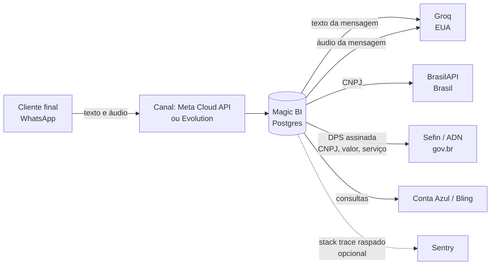

# Inventário de dados pessoais e subprocessadores — Magic BI

**Insumo técnico para o DPA e para a minuta de adesão.** Levantado do código em
26/jul/2026, campo a campo — não é estimativa.

> ## O que este documento NÃO é
>
> Não é parecer jurídico e não determina **base legal**, **prazo de retenção
> obrigatório**, **papel de controlador/operador** nem redação de cláusula. Isso
> é trabalho de advogado. O que está aqui é o levantamento factual que ele vai
> pedir: *quais dados o sistema trata, onde ficam, para onde vão e por quanto
> tempo.* A seção 6 lista as perguntas que só o jurídico responde.

---

## 1. Arranjo entre as partes (descrição factual)

- **Magic BI** — dona da plataforma; opera a infraestrutura, o banco e as
  integrações.
- **Escritório contábil parceiro** (a Rotina é o primeiro) — contrata a
  plataforma e decide quais clientes entram; seus contadores acessam apenas a
  própria carteira (isolamento implementado e testado, ver §5).
- **Cliente final** (MEI/ME/EPP) — o titular da maior parte dos dados
  pessoais. Conversa com o agente pelo WhatsApp.

Quem é controlador e quem é operador em cada tratamento é determinação
jurídica. Tecnicamente, a Magic BI tem acesso irrestrito à base
(`is_superuser`), e o escritório tem acesso apenas à carteira dele.

---

## 2. Dados pessoais armazenados

Cifrado = Fernet em repouso (`apps/credentials/crypto.py`). **Onde diz "não", o
dado está em texto claro no Postgres** — protegido por controle de acesso ao
banco, não por criptografia.

### 2.1 Do cliente final e de seus representantes

| Dado | Onde | Cifrado | Origem |
|---|---|---|---|
| CNPJ, razão social | `clients.Cliente` | não | contador ou consulta pública |
| Telefone (WhatsApp) | `clients.Cliente`, `security.SessaoWhatsapp`, `channel_whatsapp.MensagemProcessada` | não | contador |
| E-mail de contato | `clients.Cliente` | não | contador ou consulta pública |
| Inscrição municipal, CNAE, regime tributário | `clients.Cliente` | não | contador / consulta pública |
| **Conteúdo das mensagens** enviadas e recebidas | `audit.Auditoria.dados` | **não** | WhatsApp |
| Dados da nota: valor, descrição do serviço, **nome do tomador** | `agente_nf.Intencao.payload` | não | conversa |
| **CPF/CNPJ do tomador**, quando informado | `agente_nf.Intencao.payload` | não | conversa |
| Chave de acesso e protocolo da NFS-e | `agente_nf.Intencao` | não | Sefin |
| `wa_id` validado, tokens de Magic Link (só o `jti`), hash do código 2FA | `apps.security` | não (são identificadores/hashes) | sistema |

### 2.2 Segredos (cifrados)

| Dado | Onde |
|---|---|
| **Certificado digital `.pfx` do cliente** e sua senha | `credentials.Credencial` |
| Tokens OAuth de ERP (Conta Azul/Bling) | `credentials.Credencial` |
| Token do WhatsApp Cloud API do escritório | `tenants.Escritorio` |
| `client_secret` dos apps de integração | `credentials.AplicativoIntegracao` |
| `api_key` da instância Evolution | `channel_evolution.ConfiguracaoEvolution` |

### 2.3 Do contador (usuário do painel)

Nome de usuário e e-mail (`auth.User`). Sem senha utilizável: o acesso é por
Magic Link.

---

## 3. 🔴 Retenção — o ponto que exige decisão antes de tudo

**Não existe nenhuma política de retenção ou expurgo implementada. Nada é
apagado, em lugar nenhum.** Verificado: não há rotina de exclusão no código.

Dois pontos que o jurídico precisa avaliar com prioridade:

**a) A trilha de auditoria guarda o conteúdo das conversas, para sempre.**
`audit.Auditoria.dados` armazena o **texto integral** de cada mensagem recebida
e de cada resposta enviada, junto com o telefone do cliente
(`apps/channel_whatsapp/pipeline.py`, `apps/core/orchestrator.py`).

**b) Essa trilha é imutável por construção.** É append-only com hash encadeado:
o model **bloqueia `UPDATE` e `DELETE`**, e apagar qualquer linha quebraria a
cadeia de verificação de todas as seguintes. Isso foi desenhado assim de
propósito — é o que dá verificabilidade a um sistema fiscal.

A tensão é direta e não tem solução puramente técnica: **o direito de eliminação
(LGPD art. 18, VI) esbarra na imutabilidade que a auditoria fiscal exige.**
Existem caminhos técnicos (guardar hash da mensagem em vez do texto; cifrar o
conteúdo com chave por titular e destruir a chave — *crypto-shredding*; separar
trilha fiscal de trilha conversacional), mas **qual adotar depende de decisão
jurídica sobre o que precisa mesmo ser retido e por quanto tempo.** Sem essa
definição, qualquer escolha minha seria chute.

---

## 4. Subprocessadores — o que sai da nossa infraestrutura

| Quem | O que recebe | Quando | Observação |
|---|---|---|---|
| **Groq** (EUA) | **Texto integral** da mensagem do cliente; **e o áudio**, quando ele manda voz (Whisper) | toda mensagem, se `GROQ_API_KEY` estiver configurada | ⚠ o mais sensível. Ver §6 |
| **Meta / WhatsApp Cloud API** | Conteúdo das mensagens trocadas | produção | inerente ao canal escolhido |
| **Evolution API** (self-hosted) | Idem | **só teste interno** | protocolo não-oficial; a doc proíbe produção |
| **BrasilAPI** | CNPJ consultado | ao cadastrar cliente | dado público; sem autenticação |
| **Sefin / ADN (gov.br)** | DPS: CNPJ, valor, descrição do serviço, tomador | ao emitir/cancelar nota | obrigação legal, não escolha comercial |
| **Conta Azul / Bling** | Consultas à conta do **próprio cliente** | quando ele pergunta | relação preexistente dele |
| **Sentry** (opcional) | Stack trace **já raspado** de CNPJ/CPF/telefone/valores | só com `SENTRY_DSN` | desligado por padrão |

⚠ **Transferência internacional**: Groq e Sentry processam fora do Brasil.
BrasilAPI e Sefin, no Brasil.

---

## 5. Medidas de segurança implementadas (verificáveis)

Fatos, com onde conferir:

- **Isolamento entre escritórios** — contador de um escritório não alcança dados
  de outro, nem por listagem, URL direta, formulário ou agregado do dashboard.
  17 testes, no cenário de dois escritórios com **mesmo CNPJ e mesmo telefone**
  (`tests/test_multitenancy.py`).
- **Segredos cifrados em repouso** com rotação de chave sem downtime; chave fora
  de variável de ambiente (`apps/credentials/chaves.py`).
- **Trilha append-only com hash encadeado** — adulteração retroativa é detectável
  (`apps/audit/`).
- **Vínculo telefone↔CNPJ** validado por Magic Link, com sessão que expira, e 2FA
  por e-mail acima de um valor configurável (`apps/security/`).
- **Acesso do contador por Magic Link**, sem senha; escalada de privilégio
  testada (`tests/test_papeis.py`).
- **Certificado digital** cifrado, validado no upload, e a chave privada só é
  materializada em disco durante a chamada à Sefin.
- **HTTPS obrigatório** fora de DEBUG, cookies `secure`, e o sistema **recusa
  subir** com chave de sessão padrão.

**Não implementado**: auditoria de *acesso a segredo* (quem leu qual credencial)
e pentest.

---

## 6. Perguntas que só o jurídico responde

1. **Groq**: o texto — e o **áudio da voz** — do cliente final sai do Brasil a
   cada mensagem. Isso exige cláusula específica de transferência internacional
   e menção nominal na minuta de adesão. **Gravação de voz pode ser lida como
   dado biométrico** (LGPD art. 5º, II), o que mudaria o regime aplicável —
   precisa de avaliação. Há alternativa técnica se o parecer for restritivo
   (transcrição local, sem enviar áudio), mas é decisão jurídica primeiro.
2. **Retenção** (§3): por quanto tempo reter conversa, dado fiscal e trilha? E
   como conciliar o direito de eliminação com a imutabilidade da auditoria?
   A resposta define qual caminho técnico implementar.
3. **Papéis**: a Magic BI é operadora do escritório, ou há controladoria
   conjunta? Muda quem responde ao titular.
4. **Custódia do certificado digital**: guardar o `.pfx` do cliente tem peso
   próprio, já registrado em `magicbi-custodia-fiscal.md`. Qual instrumento
   cobre isso?
5. **Sentry**: se for ligado, entra como subprocessador — mesmo com o payload
   raspado. Vale antecipar na minuta ou tratar depois?
6. **Encarregado (DPO)** e canal de atendimento ao titular: quem, e por onde.

---

## 7. Lacunas técnicas conhecidas

| Lacuna | Consequência |
|---|---|
| Sem política de retenção/expurgo | dado acumula indefinidamente (§3) |
| Conteúdo de mensagem em texto claro no banco | dump do Postgres expõe conversas |
| Sem auditoria de acesso a segredo | não há como provar quem leu qual credencial |
| Sem pentest | postura de segurança não foi testada por terceiro |
| Sem exportação de dados do titular | atender pedido de portabilidade hoje é manual |
