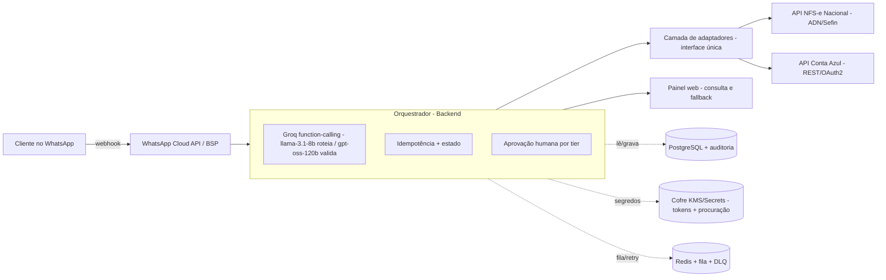

# Requisitos de desenvolvimento — Piloto Rotina Contábil
## Agente Fiscal MEI (NFS-e) + Agente Conta Azul (gestão e financeiro via WhatsApp)
### Versão 2 — especificação de engenharia, segurança, fallback e custos

> **Atualização (jul/2026):** produto agora sob a marca **Magic BI**, em parceria com a
> Rotina Contábil. O Agente Fiscal passa a se chamar **Fiscus**; o assistente
> conversacional (Hermes) é o **Lumen**; o painel é o **Grimório**. O roadmap da seção 18
> foi substituído pelo cronograma consolidado de 24 semanas em `magicbi-cronograma.md`
> (as fases 1–4 abaixo continuam válidas como o miolo do piloto). Custódia detalhada em
> `magicbi-custodia-fiscal.md`; credenciamento prévio via WhatsApp descrito lá (§4).
>
> **Atualização 2 (11/jul/2026):** o provedor de IA mudou de Anthropic (Claude) para
> **Groq** — inferência muito mais barata/rápida, decisiva no ticket baixo do MEI (ver
> `magicbi-hermes-comunicador.md` §7). Referências a "Claude"/"Haiku"/"Sonnet" abaixo
> foram atualizadas para `llama-3.1-8b-instant` (roteamento) e `openai/gpt-oss-120b`
> (validação/montagem de nota). Groq entra no inventário de subprocessadores (§9.3).

> **Documento de kickoff de desenvolvimento.** Consolida análise de negócio, requisitos
> funcionais dos dois produtos, arquitetura, **detalhamento ponto a ponto do desenvolvimento**,
> **autenticação**, **segurança e LGPD**, **fallback / continuidade (inclusive "se o WhatsApp
> cair")**, **registro de riscos**, **custos** e **onde hospedar**.
>
> **Identidade visual:** usa o logo oficial da Rotina Contábil (hexágono "RC") e a paleta da
> marca — navy `#000066` dominante, dourado `#E8A93C` como acento, periwinkle `#5B67C9` de apoio.
>
> **Aviso de verificação (⚠):** preços e detalhes de API mudam. Os valores de custo abaixo vêm
> de fontes públicas recentes (rate card da Meta para WhatsApp e tabela de preços da Groq API,
> jul/2026) e servem para ordem de grandeza. Itens marcados **⚠ verificar** dependem de
> confirmação nas fontes oficiais no momento do desenvolvimento.

---

## 1. Sumário executivo e decisão de modelo de negócio

O projeto deixou de ser "construir um ERP" e passou a ser "agentes de IA que se conectam, via
WhatsApp, a sistemas que já existem e já são validados" — o governo (emissão fiscal) e o Conta
Azul (ERP/financeiro). Isso reduz a responsabilidade regulatória e concentra o esforço no
diferencial defensável: a experiência conversacional + IA.

**Modelo recomendado: SaaS *white-label* B2B2C, distribuído pela Rotina.** Em vez de vender
direto para milhares de MEIs (CAC alto, churn alto, ticket baixo), o produto é oferecido
**através do escritório contábil**, que já tem a base, a confiança e a relação recorrente. Esse
modelo resolve três problemas de uma vez:

| Problema | Como o canal Rotina resolve |
|---|---|
| **CAC** | O escritório já tem a base — aquisição quase zero |
| **Risco fiscal** (classificação tributária) | O contador entra como validador humano no fluxo |
| **Retenção** | Trocar de contador é doloroso → receita "grudenta" |

---

## 2. Escopo do piloto

**Princípio:** começar estreito — **1 referência fiscal nacional + 2 produtos confirmados** — e
expandir só com receita validada.

| Item | Definição |
|---|---|
| Canal | Escritório Rotina Contábil (B2B2C) |
| Produto 1 | Agente Fiscal MEI — **NFS-e** (serviço), cobertura nacional |
| Produto 2 | Agente Conta Azul — gestão/financeiro, **leitura + rascunho (Tier 0–1)** |
| Coorte fiscal | 15–25 MEIs prestadores de serviço da base da Rotina |
| Coorte ERP | 5–8 clientes ME/EPP da Rotina que já usam Conta Azul |
| Duração | ~10 a 12 semanas |
| Fora do escopo | NF-e/NFC-e de produto; ações Tier 2–3; outros ERPs; outros estados |

---

## 3. Modelo de negócio

| Camada | Público | Cobrança |
|---|---|---|
| **MEI** | MEI prestador de serviço | Assinatura mensal fixa e baixa por MEI ativo (atacado p/ Rotina, que revende). Nunca por nota. |
| **ME / EPP** | Empresa com Conta Azul | Taxa de implementação + assinatura mensal por volume de interação/usuário. Markup da Rotina. |

**Evitar:** cobrança por crédito/consumo de IA; contrato anual antes de provar valor; prometer
todos os ERPs/estados no dia 1.

---

## 4. Produto 1 — Agente Fiscal MEI (NFS-e)

**Objetivo:** o MEI emite NFS-e pelo WhatsApp, sem aprender portal de governo, com o contador da
Rotina no circuito de validação. NFS-e tem padrão nacional (Emissor Nacional / ADN) — **uma
integração cobre o Brasil**.

| ID | Requisito funcional |
|---|---|
| F1.1 | Receber, em linguagem natural, a intenção de emitir nota (tomador, valor, descrição) |
| F1.2 | Estruturar os campos a partir da mensagem |
| F1.3 | **Validar CNAE e regras tributárias antes de enviar — nunca inferir alíquota livremente** |
| F1.4 | Resumo para confirmação humana (Tier 1) antes de emitir |
| F1.5 | Emitir via API NFS-e Nacional (homologação → produção) |
| F1.6 | Devolver DANFSE (PDF) e chave/link no WhatsApp |
| F1.7 | Tratar rejeição (campos IBS/CBS, dados inválidos) com mensagem clara e retry |
| F1.8 | Trilha de auditoria de toda emissão |
| F1.9 | Idempotência: mensagem repetida não gera nota duplicada |

---

## 5. Produto 2 — Agente Conta Azul

**Objetivo:** consultar e operar o Conta Azul pelo WhatsApp, sem trocar de ERP. Argumento:
*"não pedimos pra você trocar de sistema, só conectamos o que você já usa ao WhatsApp."*

| Módulo | Capacidade (piloto: leitura + rascunho) |
|---|---|
| Vendas & Pedidos | Consultar pedidos; criar rascunho de pedido |
| Estoque | Consultar posição; alertas sob demanda |
| Financeiro | Contas a pagar/receber; resumo de fluxo de caixa |
| Notas fiscais | Acompanhar emissão e status |

| ID | Requisito funcional |
|---|---|
| F2.1 | Autenticar o cliente no Conta Azul via **OAuth2** |
| F2.2 | Consultas por linguagem natural (Tier 0) |
| F2.3 | Criar **rascunho** de pedido (Tier 1) |
| F2.4 | Resumir dados financeiros de forma legível |
| F2.5 | Respeitar tiers; **bloquear Tier 2–3 no piloto** |
| F2.6 | Idempotência em qualquer escrita |
| F2.7 | Trilha de auditoria |

API Conta Azul (confirmado): REST · OAuth2 · módulos Vendas/Estoque/Cadastros/Financeiro/Notas ·
portal de desenvolvedor próprio · 2FA na configuração do app. ⚠ verificar escopos, limites e payloads.

---

## 6. Arquitetura técnica

**Princípio central — um cérebro, vários adaptadores.** Uma interface interna única
(`consultar`, `criar_rascunho`, `alterar`, `emitir`) com um **adaptador por integração**. Permite
atender Conta Azul hoje e Bling/Tiny/Omie depois **sem reescrever o agente**.

---

## 7. Pontos de desenvolvimento — detalhamento por componente

Cada componente abaixo é uma unidade de trabalho com responsabilidades, entradas/saídas e cuidados.

### 7.1 Canal WhatsApp (ingestão)
- **Webhook de entrada**: endpoint HTTPS público que recebe mensagens. Validar o `verify_token`
  no handshake e a assinatura `X-Hub-Signature-256` (HMAC com o App Secret) em cada POST.
- **Janela de 24h**: a conversa iniciada pelo cliente abre uma janela de serviço de 24h em que
  respondemos livremente e **sem custo**; a janela reinicia a cada mensagem do cliente. Fora da
  janela, só *templates* aprovados (custo por mensagem).
- **Templates**: cadastrar templates de *utility* para notificações proativas (ex.: "sua nota foi
  emitida", "ação pendente de aprovação"). Categoria correta = custo baixo.
- **Botões interativos**: usar *interactive buttons/list* para a aprovação Tier 1 (confirmar/cancelar).
- **Quality rating**: monitorar; bloqueios/spam derrubam o rating e limitam envio.
- **Conformidade Meta (jan/2026)**: o agente deve ser **task-specific** (emissão fiscal, consulta
  de ERP) — "IA de propósito geral" é proibida. Descrever claramente o propósito no onboarding.

### 7.2 Orquestrador / motor de IA
- **Roteamento de modelo (Groq)**: usar **`llama-3.1-8b-instant`** para classificação de intenção,
  extração de campos e roteamento (alto volume, barato, ~560 tok/s); escalar para
  **`openai/gpt-oss-120b`** na validação/raciocínio mais delicado (ex.: montar a nota, conferência
  tributária). ⚠ **verificar catálogo Groq vigente** antes de fixar um 3º modelo de reserva para
  casos raros de raciocínio mais exigente — a Groq deprecia/adiciona modelos com frequência (ex.:
  Qwen3 32B e Llama 4 Scout 17B saíram em jun/2026).
- **Function-calling**: cada ação (`consultar_pedido`, `emitir_nfse`, …) é uma *tool* atrás do
  adaptador. O modelo nunca chama API externa direto — sempre via camada de adaptadores.
- **Prompt caching**: marcar system prompt + esquema de tools como prefixo estável (cache) — corta
  ~90% do custo de input repetido.
- **Estado da conversa**: máquina de estados por usuário (coletando dados → aguardando confirmação →
  executando → concluído). Persistir no Postgres, não na memória do processo.
- **Guard de saída**: nunca deixar o modelo "inventar" alíquota/CNAE; validação determinística antes
  de qualquer emissão.

### 7.3 Camada de adaptadores
- Interface interna única e estável: `consultar(entidade, filtro)`, `criar_rascunho(payload)`,
  `alterar(id, payload)`, `emitir(payload)`. Um adaptador por integração implementa o contrato.
- Tradução de erros externos para um **catálogo de erros interno** (ex.: `REJEICAO_FISCAL`,
  `AUTH_EXPIRADA`, `RATE_LIMIT`, `INDISPONIVEL`) que o orquestrador sabe tratar.

### 7.4 Adaptador NFS-e
- Cadastro e testes em **homologação ("Produção Restrita")**; só depois produção.
- Emissão via REST/JSON do Emissor Nacional; tratamento de rejeição (incl. IBS/CBS) e retry.
- **Regras tributárias configuráveis** (jamais *hardcoded*) — a legislação está em adequação.

### 7.5 Adaptador Conta Azul
- Fluxo **OAuth2 authorization code** por cliente; refresh token no cofre; renovação automática.
- Mapear endpoints de Vendas/Estoque/Financeiro/Notas para a interface interna.
- **Cache de leitura** de curto prazo (ex.: posição de estoque/financeiro) para degradação graciosa
  quando a API estiver indisponível.

### 7.6 Motor de aprovação por tier
- Classifica cada ação em Tier 0–3 e aplica o gate: Tier 0 executa; Tier 1 pede confirmação 1-clique;
  Tier 2/3 (fora do piloto) exigem aprovação humana / confirmação fora do WhatsApp.

### 7.7 Idempotência e fila
- Chave de idempotência derivada do `message_id` do WhatsApp em **toda escrita** (nota/rascunho).
- Fila (Redis + BullMQ, ou SQS) com **retry exponencial**, **circuit breaker** por integração e
  **dead-letter queue** (DLQ) para mensagens que falham além do limite.

### 7.8 Cofre de credenciais
- Secrets Manager + KMS (envelope encryption). Tokens OAuth e procuração isolados, com rotação.
- **Nunca** armazenar `.pfx` cru. Acesso por *least privilege* e auditado.

### 7.9 Trilha de auditoria
- Tabela **append-only**: quem, quando, ação, payload (com PII minimizada/mascarada), resultado,
  correlação com `message_id`. Base de defesa jurídica e de conformidade LGPD.

### 7.10 Painel web (consulta e fallback) — **crítico**
- Dashboard *read-only* para o **cliente** e para o **contador da Rotina**: notas emitidas e status,
  pedidos consultados/rascunhos, pendências de aprovação, histórico, download de DANFSE.
- Login por **magic link / OTP** (sem senha). É o canal de consulta quando o WhatsApp estiver fora.
- Exportação (PDF/CSV) para o cliente sempre ter os documentos, independente do canal.

### 7.11 Observabilidade
- Logs estruturados + Sentry; métricas (latência, taxa de erro por integração, tamanho de fila/DLQ);
  **alertas de rejeição fiscal** e de indisponibilidade de integração. Falha fiscal nunca silenciosa.

### 7.12 Esquema de dados (núcleo)
`clientes`, `vinculos_fiscais` (procuração/cert por cliente), `conexoes_erp` (tokens OAuth),
`conversas` (estado), `acoes` (auditoria append-only), `notas` (emissões + status), `aprovacoes`,
`fila_eventos`. PII criptografada em repouso; segredos só no cofre, nunca nas tabelas.

---

## 8. Autenticação — detalhada

### 8.1 WhatsApp (webhook)
- **Handshake**: validar `hub.verify_token` no registro do webhook.
- **Cada requisição**: validar `X-Hub-Signature-256` (HMAC-SHA256 do corpo com o **App Secret**);
  rejeitar se não bater. Aceitar apenas IPs/origem da Meta quando possível.

### 8.2 Conta Azul (OAuth2)
- **Authorization Code** (com **PKCE** se suportado), por cliente. Solicitar apenas os **escopos
  mínimos** necessários (Vendas/Estoque/Financeiro/Notas — leitura + criação de rascunho no piloto).
- A configuração inicial do app pede **2FA**. Guardar **refresh token criptografado** no cofre;
  renovar access token; tratar `AUTH_EXPIRADA` reabrindo o consentimento. ⚠ verificar escopos exatos.

### 8.3 Identidade fiscal (NFS-e)
- **Procuração eletrônica (gov.br / e-CAC)** com escopo limitado — **recomendado para começar**: o
  cliente autoriza a aplicação a agir por ele, sem custódia de certificado.
- Alternativa: **certificado em nuvem** (AC guarda o certificado; recebemos token de assinatura por
  sessão). **Evitar** armazenar `.pfx` do cliente.

### 8.4 Autenticação interna
- **Serviço-a-serviço**: mTLS ou tokens assinados de curta duração entre componentes.
- **Painel web** (cliente/contador): login por magic link/OTP; sessões curtas; **RBAC** (cliente vê
  só os próprios dados; contador da Rotina vê a carteira dele).
- Segredos só via cofre; nada de credencial em código, log ou variável de ambiente em texto puro.

---

## 9. Segurança e LGPD — detalhada

### 9.1 Inventário de dados pessoais e base legal
| Dado | Uso | Base legal sugerida |
|---|---|---|
| Telefone, nome | Identificação no WhatsApp | Execução de contrato / consentimento |
| CNPJ/CPF do MEI, dados fiscais | Emissão de nota | Execução de contrato + obrigação legal |
| Tokens OAuth (Conta Azul) | Acesso ao ERP do cliente | Execução de contrato |
| Conteúdo das mensagens | Operação do agente | Execução de contrato / legítimo interesse |

### 9.2 Controles técnicos
- Criptografia **em trânsito** (TLS) e **em repouso** (KMS); segredos isolados no cofre.
- **Least privilege** em todos os acessos; segregação de ambientes (dev/homolog/prod).
- Mascaramento/minimização de PII em logs e auditoria; rede privada para o banco e o cofre.
- **Conformidade Meta (jan/2026)**: agente task-specific (não "IA de propósito geral").

### 9.3 Retenção, direitos do titular e governança
- Política de **retenção e descarte** (mensagens, logs) com prazos definidos; documentos fiscais
  seguem prazos legais próprios.
- Atender **direitos do titular** (acesso, correção, eliminação) via painel/processo.
- **DPA** com a Rotina e com cada **subprocessador** (BSP do WhatsApp, nuvem, eventual middleware
  fiscal). Indicar **encarregado/DPO**. **Plano de resposta a incidentes** com prazos de notificação.

**Subprocessador Groq (atualizado 11/jul/2026 — troca de Anthropic por Groq):**
- A Groq processa **conteúdo da mensagem** (texto do cliente) para roteamento/extração de campos,
  não CNAE/alíquota/decisão fiscal (guard determinístico — nunca sai do núcleo). Infraestrutura de
  inferência primariamente nos EUA: ⚠ **confirmar** política de retenção/treinamento da Groq para
  clientes de API (tipicamente não usa dados de API para treinar, mas precisa confirmar no contrato
  vigente) e mecanismo de transferência internacional adequado à LGPD (cláusulas contratuais
  padrão/SCC) antes de produção.
- **Ação de kickoff**: adicionar a Groq ao inventário de subprocessadores do DPA com a Rotina (no
  lugar da Anthropic); revisar minuta do termo de adesão do cliente final para citar o provedor de
  IA corretamente (ver `magicbi-cronograma.md`, Fase 0).
- Minimização: só o texto da mensagem (e transcrição de áudio, se D6 entrar) trafega para a Groq —
  nunca CNPJ/CPF, tokens OAuth ou credenciais, que não passam pelo LLM em nenhuma etapa.

---

## 10. Fallback, resiliência e continuidade

### 10.1 Princípios
Idempotência em toda escrita · retry com *backoff* exponencial · *circuit breaker* por integração ·
*dead-letter queue* · **degradação graciosa** (nunca falhar em silêncio) · o **registro canônico
vive no nosso banco**, não no WhatsApp — então o canal pode cair sem perder informação.

### 10.2 Se o WhatsApp cair — como o cliente consulta as informações
Porque tudo é persistido no backend e na auditoria, o WhatsApp é só um canal de entrada/saída. Se ele
ficar indisponível:
1. **Painel web (read-only)** — canal primário de consulta: notas emitidas e status, pedidos,
   pendências, histórico, **download de DANFSE/PDF**. Login por magic link/OTP.
2. **Notificações por e-mail/SMS** dos eventos críticos (nota emitida, falha, aprovação pendente),
   para o cliente não ficar cego.
3. **Status page** informando a indisponibilidade e o que está em fila.
4. **Fila de reprocessamento**: mensagens não entregues ficam na fila e são despachadas quando o
   WhatsApp volta; nada se perde.
5. **Contador da Rotina como canal humano**: acessa o mesmo painel e atende o cliente diretamente.
6. (Evolução) **Segundo BSP** como redundância de canal.

### 10.3 Se a NFS-e Nacional cair (instabilidade já relatada em 2026)
- **Modo de contingência**: enfileirar a emissão, informar o cliente ("recebido, emitindo assim que
  o sistema nacional voltar"), retry automático; nunca dar a nota como emitida sem confirmação.
- Alertas operacionais; auditoria registra o estado "pendente de emissão".

### 10.4 Se o Conta Azul cair
- **Leitura**: servir do **cache de leitura** (última posição conhecida), marcando "dado pode estar
  desatualizado".
- **Escrita** (rascunho): enfileirar e confirmar quando a API voltar; idempotência evita duplicidade.

### 10.5 Se a API do Groq cair
- **Parser determinístico de fallback**: comandos/menu estruturado ("1 - emitir nota, 2 - consultar
  pedido…") para as ações mais comuns, sem depender do LLM — **já implementado** no orquestrador
  (`apps/core/orchestrator.py`): sem `GROQ_API_KEY`, ou se a chamada falhar/der timeout, o
  roteamento e a extração de campos caem no parser por palavra-chave automaticamente.
- Enfileirar e retomar o fluxo conversacional quando o serviço voltar.

### 10.6 Matriz de fallback
| Dependência | Detecção | Fallback | Cliente percebe? |
|---|---|---|---|
| WhatsApp | webhook/health | Painel web + e-mail/SMS + fila | Usa o painel; recebe notificações |
| NFS-e Nacional | erro/timeout | Fila + contingência + retry | "Emitindo, te aviso quando sair" |
| Conta Azul | erro/timeout | Cache de leitura + fila de escrita | Dado marcado como possivelmente antigo |
| Groq API | erro/timeout | Menu determinístico + fila | Menu numérico simples |
| Banco/infra | health check | Réplica/failover gerenciado | Indisponibilidade breve |

---

## 11. Riscos — registro detalhado

| ID | Categoria | Risco | Prob. | Impacto | Severidade | Mitigação / contingência |
|---|---|---|---|---|---|---|
| R1 | Fiscal/Custódia | Vazamento de credencial fiscal do MEI | Baixa | Altíssimo | **Crítica** | Procuração eletrônica; cofre KMS; nunca `.pfx`; least privilege; auditoria |
| R2 | Fiscal/Operacional | Erro de classificação tributária (CNAE/alíquota) | Média | Alto | Alta | Validação determinística; contador no loop; nada de inferência livre |
| R3 | ERP | Escrita indevida em pedido | Média | Alto | Alta | Tiers 0–1 no piloto; idempotência; confirmação humana |
| R4 | Disponibilidade | Queda do WhatsApp / BSP | Média | Médio | Média | Painel web + e-mail/SMS + fila; (evolução) 2º BSP |
| R5 | Disponibilidade | Instabilidade da NFS-e Nacional | Média-alta | Médio | Média-alta | Modo contingência + fila + retry; alertas |
| R6 | Disponibilidade | Queda do Conta Azul | Média | Médio | Média | Cache de leitura + fila de escrita |
| R7 | IA | Queda/latência da API Groq | Baixa | Médio | Média | Menu determinístico + fila (já implementado) |
| R8 | IA | Resposta incorreta do agente | Média | Médio-alto | Média-alta | Validação determinística; aprovação humana; auditoria |
| R9 | Regulatório | Mudança de legislação (Reforma até 2027) | Alta | Médio | Média-alta | Regras configuráveis; manutenção contínua |
| R10 | Plataforma | Bloqueio por política da Meta (IA de propósito geral) | Baixa | Alto | Média | Agente task-specific; propósito declarado; bom quality rating |
| R11 | Negócio/Jurídico | Responsabilidade civil por erro do agente | Média | Alto | Alta | Contrato com escopo claro; advogado antes de produção; seguro se o volume justificar |
| R12 | Segurança | Incidente/vazamento de dados (LGPD) | Baixa | Altíssimo | **Crítica** | Cripto; isolamento; DPA; plano de incidentes; DPO |
| R13 | Custo | Estouro de custo de IA | Baixa | Médio | Baixa-média | Roteamento llama-3.1-8b/gpt-oss-120b na Groq; caching; limites e alertas de gasto |
| R14 | Mercado | Concorrência de soluções gratuitas (governo/Sebrae) | Média | Médio | Média | Diferencial é a conveniência via WhatsApp, não a emissão |

---

## 12. Custo (ordem de grandeza — piloto)

> Valores aproximados (jun/2026). Conversão ~US$1 ≈ R$5 só para referência. **⚠ verificar** no
> momento da contratação.

### 12.1 WhatsApp (mensageria)
- **Mensagem de serviço iniciada pelo cliente, dentro da janela de 24h: gratuita.** Como os agentes
  respondem a quem inicia, o grosso do tráfego não tem custo Meta.
- Só **templates** fora da janela custam — em geral *utility* no Brasil ~R$0,04–0,08/mensagem;
  *marketing* é bem mais caro (~R$0,31–0,39) e **não** vamos usar.
- **Piloto**: estimado **~R$0–100/mês** (poucas notificações utility).
- **BSP** (plataforma): plano/fee + eventual markup — faixa típica **~R$200–1.000/mês** no piloto.

### 12.2 Inteligência (Groq API — trocado de Anthropic em 11/jul/2026)
- `llama-3.1-8b-instant` (US$0,05/US$0,08 por milhão de tokens) para roteamento/extração;
  `openai/gpt-oss-120b` (US$0,15/US$0,60) para validação/montagem de nota — **ordem de grandeza
  mais barato** que Haiku/Sonnet, decisivo no ticket de R$ 20–50/mês do MEI. Batch API + prompt
  caching cortam mais ~50–75% quando aplicável.
- Custo por interação estimado **~US$0,001–0,01** (vs ~US$0,01–0,05 no Claude). Piloto com
  1.000–3.000 interações/mês ≈ **~US$1–30/mês (R$5–150)** — ⚠ **verificar preço vigente**
  (groq.com/pricing) antes de fechar orçamento, tabela muda com frequência.

### 12.3 Infraestrutura
- App + **Postgres gerenciado** + **Redis** + Secrets/KMS, em região Brasil (ou PaaS): **~US$50–150/mês
  (R$300–900)** no piloto. HSM dedicado só em escala (custo bem maior — usar KMS no piloto).

### 12.4 Fiscal
- **Procuração eletrônica: gratuita** (gov.br). Certificado em nuvem (se usado): ~R$200–500/ano por
  certificado — em B2B2C o contador pode já possuí-lo.
- **Middleware "NF como serviço"** só na **fase 2** (NF-e de produto): ~R$0,10–0,50/nota ou mensalidade
  pequena. **Não entra no piloto.**

### 12.5 Total estimado do piloto (serviços/infra, sem pessoas)
**~R$600–2.800/mês.** O custo dominante é o **fee do BSP + tokens de IA**, não a mensageria do
WhatsApp (que é majoritariamente gratuita por ser iniciada pelo cliente). O esforço de
**desenvolvimento** (pessoas) é à parte — estimado em **~2–3 pessoas por ~10–12 semanas**.

### 12.6 Em escala (por cliente ativo)
Tende a poucos reais/mês por cliente em IA + uma fração do fee de BSP rateada; a margem cresce com o
volume porque a mensageria de serviço permanece gratuita.

---

## 13. Onde hospedar

| Opção | Prós | Contras | Quando usar |
|---|---|---|---|
| **AWS São Paulo (`sa-east-1`)** | Dados no Brasil (LGPD), baixa latência, RDS/ElastiCache/Secrets/KMS prontos | Curva de setup maior | **Recomendado para produção** |
| **GCP / Azure região Brasil** | Equivalentes; usar se o time já domina | Idem | Alternativa equivalente |
| **PaaS (Render/Railway/Fly)** | Setup rápido, bom p/ piloto | Menos controle; conferir residência de dados/LGPD | **Piloto**, se a prioridade for velocidade |
| **BSP brasileiro c/ LGPD** | Já trata invoice BRL, Pix, LGPD do canal | Menos flexível | Para a camada WhatsApp |

**Recomendação:** produção em **AWS `sa-east-1`** (residência de dados + latência); para o piloto,
um PaaS em região Brasil é aceitável se acelerar a entrega, desde que se confirme a residência dos
dados para LGPD. Banco e cofre sempre em rede privada.

---

## 14. O que precisamos (pré-requisitos de kickoff)

**Contas e credenciais**
- [ ] Conta WhatsApp Business Platform via **BSP** (ou Meta direto); número, App Secret, verify token, templates
- [ ] **App de desenvolvedor no Conta Azul** (OAuth2) com escopos definidos
- [ ] Cadastro e acesso à **homologação da API NFS-e Nacional**
- [ ] Conta de **nuvem** (AWS `sa-east-1` recomendado) + **Secrets Manager/KMS**
- [ ] Chave da **API Groq** (console.groq.com/keys) com limites/alertas de gasto configurados

**Definições de negócio/jurídico**
- [ ] Modelo de **custódia fiscal** (procuração eletrônica como ponto de partida)
- [ ] **Coorte** do piloto na base da Rotina (MEIs + ME/EPP Conta Azul)
- [ ] **DPA** com a Rotina e subprocessadores; **DPO** indicado
- [ ] **Advogado**: responsabilidade e contrato antes de qualquer escrita real em produção

**Time (estimativa para o piloto)**
- [ ] 1 backend (orquestrador + adaptadores + fila/segurança)
- [ ] 1 full-stack (painel web + integrações + WhatsApp)
- [ ] 1 contador/produto (regras fiscais, validação, coorte) — pode ser da própria Rotina

**Ferramentas**
- [ ] Repositório + CI/CD; ambientes dev/homolog/prod; Sentry/observabilidade; gestão de segredos

---

## 15. Governança: tiers de risco + idempotência

| Tier | Categoria | Exemplo | Quem decide |
|---|---|---|---|
| **0** | Leitura | Consultar pedido, estoque, status de nota | Agente decide sozinho |
| **1** | Escrita baixa | Criar rascunho; emitir NFS-e simples validada | Agente cria; nada confirma sem aprovação |
| **2** | Escrita média | Alterar item/quantidade de pedido não confirmado | Aprovação humana em 1 clique |
| **3** | Escrita alta | Pedido confirmado, endereço, pagamento, cancelamento | Aprovação humana + confirmação fora do WhatsApp |

**No piloto, toda escrita fica em Tier 0–1.** Idempotência por `message_id` evita duplicidade.

---

## 16. Requisitos não-funcionais (com metas)

| Categoria | Requisito / meta |
|---|---|
| Segurança | Cofre isolado; cripto repouso/trânsito; nunca `.pfx` cru; least privilege |
| Confiabilidade | Idempotência; retries; circuit breaker; DLQ; modo contingência |
| Disponibilidade | Degradação graciosa; painel web como fallback; sem falha silenciosa |
| Auditabilidade | Log append-only de toda ação fiscal e escrita |
| Privacidade | LGPD; minimização; DPA; direitos do titular |
| Desempenho | Resposta conversacional de leitura em poucos segundos |
| Manutenibilidade | Padrão adaptador; regras tributárias configuráveis |
| Observabilidade | Logs estruturados, Sentry, alertas de rejeição fiscal e de fila/DLQ |

---

## 17. Métricas e critérios de sucesso do piloto

| Métrica | O que medir |
|---|---|
| Ativação | % da coorte que emite/consulta pela 1ª vez |
| Adoção | % de notas via WhatsApp vs portal |
| Qualidade | Taxa de rejeição / erro fiscal ≈ 0 |
| Eficiência | Tempo p/ emitir; horas do contador economizadas |
| Satisfação | NPS + disposição a pagar |

---

## 18. Roadmap / fases

| Fase | Semanas | Entrega |
|---|---|---|
| 1 — Fundação | 1–3 | WhatsApp Cloud API, backend, cofre, fila, painel base, fluxo de procuração |
| 2 — Agente Fiscal MEI | 3–6 | NFS-e homologação → produção; coorte 15–25 MEIs |
| 3 — Agente Conta Azul | 5–8 | OAuth2 + leitura/rascunho (Tier 0–1); 5–8 ME/EPP |
| 4 — Operar & medir | 8–12 | Rodar, métricas, decidir expansão |
| Pós-piloto | — | NF-e de produto (middleware); 2º ERP; outros estados |

---

## 19. Backlog inicial (épicos)

**A — Canal WhatsApp**: webhook + assinatura; dedupe/idempotência; templates utility; botões de aprovação.
**B — Orquestrador IA**: Groq function-calling (Pydantic AI); roteamento llama-3.1-8b/gpt-oss-120b; caching; estado; guard de saída.
**C — Adaptador NFS-e**: homologação; validação CNAE/alíquota; emissão + DANFSE; rejeição/retry.
**D — Adaptador Conta Azul**: OAuth2 + refresh no cofre; consultas (Tier 0); rascunho (Tier 1); cache de leitura.
**E — Painel web/fallback**: dashboard read-only; magic link/OTP; export PDF/CSV; notificações e-mail/SMS.
**F — Resiliência**: fila + retry + circuit breaker + DLQ; modos de contingência; status page.
**G — Segurança & custódia**: cofre KMS; procuração eletrônica; auditoria append-only; DPA/LGPD.
**H — Observabilidade**: logs + Sentry; alertas de rejeição fiscal, fila/DLQ e gasto de IA.

---

## 20. Checklist de kickoff

- [ ] Confirmar modelo de custódia (procuração eletrônica)
- [ ] Homologação da API NFS-e Nacional
- [ ] App desenvolvedor no Conta Azul (OAuth2) + escopos
- [ ] Selecionar BSP do WhatsApp; número/templates; validar conformidade IA task-specific
- [ ] Provisionar nuvem (AWS `sa-east-1`) + cofre
- [ ] Definir coorte do piloto na base da Rotina
- [ ] DPA + DPO; cripto e auditoria
- [ ] Tiers 0–1 em toda escrita
- [ ] Advogado: responsabilidade antes de escrita real em produção

---

## 21. Pendências de verificação (⚠)

- Campos atuais de **IBS/CBS** na NFS-e Nacional e estado das APIs de produção.
- **Escopos OAuth, limites de taxa e payloads** do Conta Azul.
- **Rate card atual do WhatsApp** (Brazil; migração para BRL a partir de jul/2026) e fee do BSP escolhido.
- **Preços da Groq API** vigentes (mudam com frequência) e melhor mix llama-3.1-8b/gpt-oss-120b por volume real; catálogo de modelos suportados (deprecia modelos, ex. jun/2026).
- Decretos de **obrigatoriedade estadual (abr/2026)** e **novo leiaute (2027)** para a coorte.
- Para a fase 2: comparar **2–3 fornecedores de "NF como serviço"** (preço/cobertura) para NF-e no Maranhão.
